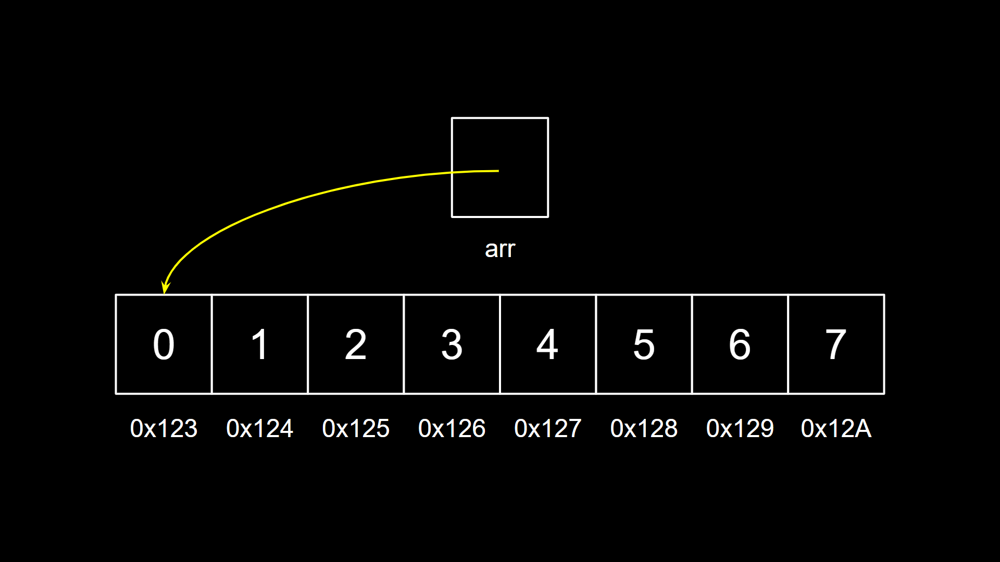
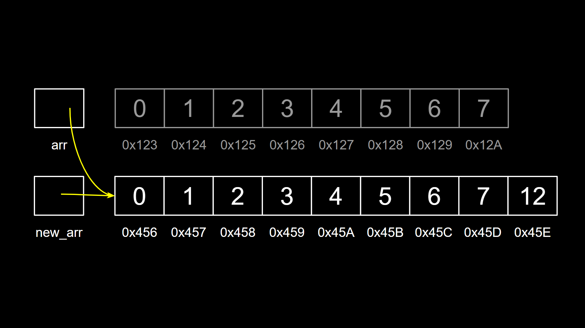
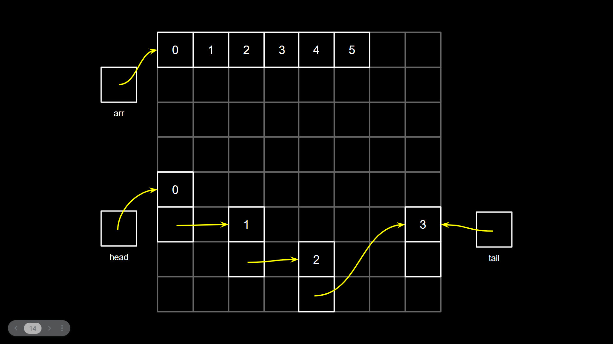
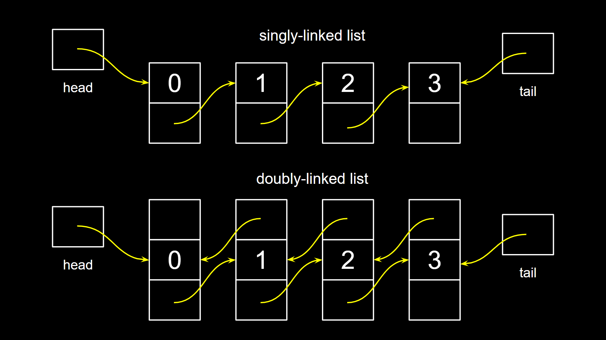

# Estrutura de Dados

Oi, pessoal!

Neste repositório pretendo explicar algumas estruturas de dados fundamentais para nosso avanço nos estudos de ciência da computação.
Hoje, apesar de trabalhar com algumas linguagens de alto nível como C#, Java e Python, confesso que muito do conteúdo dessa disciplina ainda era novo para mim.
Se eu tivesse o entendimento dessas estruturas de dados há mais tempo, minha carreira teria sido diferente. Porém, nunca é tarde, certo?

Então vamos lá!

Acompanhe abaixo as minhas explicações a respeito de algumas estruturas de dados e seus exemplos.

## Índice

## Propósito

Não sei se comentei antes, mas estou criando esse conteúdo com base nos meus estudos através do CS50, que é o curso de Introdução à Ciência da Computação de Harvard. Eu havia feito esse curso em 2021 quando estava em transição de carreira para a área da programação. Depois que entrei no mercado de trabalho como programador, nunca me vi na necessidade de entender estrutura de dados, algoritmos, etc. Afinal, para desenvolver muitos serviços CRUD eu acabei focando mais em aprender os frameworks do que os fundamentos.

Porém, hoje, vejo que pular essa etapa me custou um pouco... se eu tivesse entendido melhor esses conceitos da primeira vez que tive contato com eles, acredito que estaria mais avançado na minha carreira. E é por isso que resolvi refazer o curso mais atualizado já que agora tenho mais experiência no mundo de desenvolvimento de software e tudo é muito mais claro agora.

## Arrays e Listas Encadeadas

Durante toda minha vida, eu só havia me deparado com Listas Encadeadas (Linked Lists) em desafios do LeetCode ou HackerRank. Na verdade, eu nunca havia entendido o porquê de elas existirem. Até que isso mudou recentemente quando voltei a estudar com mais atenção a linguagem C.

Sempre que preciso criar listas eu utilizo arrays como a estrutura de dados principal. Como sempre trabalhei com linguagens mais abstratas, eu não imaginava que por baixo dos panos, a linguagem lidava com o "custo" de memória que um array leva para ser manipulado. Em C, quando vamos criar um array, precisamos alocar seus endereços na memoria. Esse array nada mais é do que um ponteiro que aponta para o primeiro endereço de uma sequência contínua de valores de mesmo tipo armazenados em posições consecutivas na memória.

```c
int n = 8;
int *arr = malloc(n * sizeof(int));

for (int i = 0; i < n; i++)
    arr[i] = i;
```



Agora digamos que queremos adicionar um novo elemento nesse array. Na linguagem C, se tentarmos fazer como fazemos em outras linguagens de alto nível (`arr[9] = 8`) teremos um erro de segmentação de memória (segmentation fault). Isso ocorre porque estaremos acessando um endereço de memória que não foi previamente alocado.

Então, para conseguir fazer isso, precisaremos alocar um novo espaço na memória, agora de tamanho de 9 inteiros, copiar todo o conteúdo do array anterior para esse novo array, adicionar o novo elemento na última posição, liberar os endereços do array antigo e apontá-lo para o novo array. Complicado né? Em linguagens como Python, Java e JavaScript a própria linguagem faz esse trabalho pra gente, porém em C seria mais ou menos assim:

```c
n++;
int *new_arr = malloc(n * sizeof(int));

for (int i = 0; i < n; i++)
    new_arr[i] = arr[i];

new_arr[n - 1] = 12;
free(arr);
arr = new_arr;
```



Viu como é mais complexo e como estamos utilizando mais espaço na memória apenas para aumentar um array? Processos semelhantes de realocação também ocorrem ao remover ou adicionar itens no início ou meio do array. Para listas pequenas, isso na maioria das vezes não é um problema. Porém, se estamos lidando com uma grande quantidade de dados, ou com filas (queues) e pilhas (stacks), talvez precisamos pensar em uma outra estrutura de dados. E aqui conhecemos as **listas encadeadas (linked lists)**.

*Obs: em C, também existe a função realloc, que pode realocar um ponteiro para um novo endereço de memória com o novo tamanho desejado, porém, quis mostrar esse processo com o malloc para que se entenda a complexidade de fazer isso.*

Com as listas encadeadas nós não precisamos nos preocupar com realocação de memória, pois ao invés de o ponteiro apontar para endereços seguidos, o ponteiro irá apontar para um outro endereço na memória, que conterá um nó.



Os nós são os elementos de uma lista encadeada. Podemos ter listas encadeadas simples ou duplas (singly-linked lists or doubly-linked lists). A diferença das duas é que na primeira, teremos um nó com um valor e um ponteiro para o próximo nó. Na segunda, teremos um nó com um valor, um ponteiro para o próximo nó e um ponteiro para o nó anterior. Dependendo da aplicação, isso pode facilitar operações como percorrer a lista em ordem reversa, por exemplo.



```c
typedef struct _node
{
    int value;
    struct _node *next;
} 
node;

typedef struct _double_node
{
    int value;
    struct _double_node *prev;
    struct _double_node *next;
}
double_node;
```

As listas encadeadas são ótimas para implementação de filas (FIFO - First In, First Out) e pilhas (LIFO - Last In, First Out). Elas são estruturas de dados bastante usadas na computação. Por exemplo, um servidor recebe suas requisições HTTP em uma fila e as processa à medida que a anterior for executada. A primeira requisição a ser recebida terá a prioridade de execução. Já a pilha é utilizada no gerenciamento da memória stack do computador e executa a última função incluída na stack em prioridade das primeiras.

Para ver exemplos das implementações, veja [queue](./linked_list/queue.c) e [stack](.linked_list/queue.c).

```bash
$ gcc queue.c ../helpers.c -o queue
$ gcc stack.c ../helpers.c -o stack
$ ./queue
0 10 20 30 40 50 60 70 80 90 
20 30 40 50 60 70 80 90 
$ ./stack
90 80 70 60 50 40 30 20 10 0 
70 60 50 40 30 20 10 0 
```

Por fim, podemos entender as diferenças entre as Listas Encadeadas e os Arrays.
Para muitos casos, quando lidamos com poucos dados, não fará tanta diferença escolher entre arrays e listas encadeadas. Porém, se precisarmos lidar com muitos dados ou arquivos, é recomendável utilizar listas encadeadas para melhor desempenho.

| Característica         | **Array** | **Linked List**           |
| ---------------------- | --------- | ------------------------- |
| Tamanho                | Fixo      | Dinâmico                  |
| Acesso por índice      | `O(1)`    | `O(n)`                    |
| Inserção/remoção       | `O(n)`    | `O(1)` no início/fim      |
| Uso de memória         | Compacto  | Mais overhead (ponteiros) |
| Localidade de cache    | Boa       | Ruim                      |
| Complexidade de código | Simples   | Mais complexa             |

